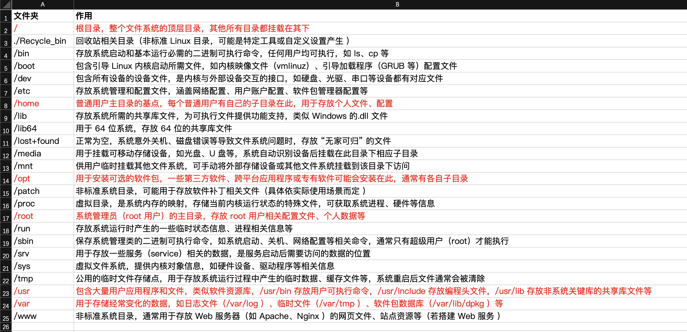

# Gin 框架

---

**_创建时间 2024-11-24_**

## 文件结构

```bash
├── assets # 静态资源
├── docs # 文档
├── gin # gin web framework 框架
│   ├── controllers # 控制器
│   ├── main.go # gin 入口文件
│   ├── models # SQL
│   ├── routers # 路由
├── go.sum # 三方库
├── grammar # 基础语法写法
├── main.go # 基础语法入口

```

## 热更新

```go
go install github.com/air-verse/air@latest
// 启动命令
air
```

## 基础路由引擎

```go
import("github.com/gin-gonic/gin")
func main () {
  // 创建一个默认的路由引擎
	r := gin.Default()
  // 配置路由
	r.GET("/", func(c *gin.Context) {
		c.String(200, "值：%v", "你好golang gin")
	})
  // 路由分组
  routers.InitRouters(r)
  // 启动一个web服务
	runErr := r.Run(":9981")
	if runErr != nil {
		fmt.Println("gin 启动失败！！！")
	}
}
```

### 接口参数

```go
// GET 拼接参数 c.Query
AdminRouters.GET("/parameter", func(c *gin.Context) {
	userName := c.Query("userName")
	c.Set("response", "成功"+userName)
})

// 动态路由 c.Param
AdminRouters.GET("/param/:uid", func(c *gin.Context) {
	uid := c.Param("uid")
	c.Set("response", uid)
})

// post 获取body 中的参数 c.PostForm
// Content-Type: application/x-www-form-urlencoded 或 multipart/form-data
AdminRouters.POST("parameter-post", func(c *gin.Context) {
	name := c.PostForm("name")

	mapStr := c.PostForm("map")
	var parseMap map[string]interface{}
	mapErr := json.Unmarshal([]byte(mapStr), &parseMap)
	fmt.Println("mapErr --->", mapErr)
	if mapErr != nil {
		// 设置错误信息并返回
		c.Error(fmt.Errorf("map格式无效: %v", mapErr))
		return
	}

	listStr := c.PostForm("list")
	var parsedList []map[string]interface{}
	listErr := json.Unmarshal([]byte(listStr), &parsedList)
	fmt.Println("listErr --->", listErr)
	if listErr != nil {
		c.Error(fmt.Errorf("list 列表个格式无效: %v", mapErr))
		return
	}

	fmt.Printf("name: %v, map: %v, list: %v \n", name, parseMap, parsedList)
	c.Set("response", "post 数据成功！！！")
})

```

#### POST application/json

- ShouldBindJSON、 BindJSON：区别：

  - 当 `BindJSON` 遇到错误时，它会直接中止请求处理流程并返回一个 `400 Bad Request` 错误响应。

  - 它不允许开发者自定义错误处理逻辑，因为它内部会自动处理错误并向客户端发送错误响应。

  - `ShouldBindJSON` 只是尝试进行绑定操作，当绑定出现错误时，它不会自动发送错误响应。

  - 它将错误信息返回给开发者，允许开发者自定义错误处理逻辑。开发者可以根据具体情况，例如错误类型，决定是否返回错误，以及返回什么样的错误响应。

```go
// Content-Type: application/json
type type RequestData struct {
    Key string `form:"key" json:"key"`
}
var data RequestData
if err := c.ShouldBind(&data); err != nil {
    c.JSON(400, gin.H{"error": err.Error()})
    return
}
```

### 路由分组

```go
// routers/initRouters
package routers
func InitRouters(r *gin.Engine) {
	BasicRoutersInit(r)
	AdminRoutersInit(r)
	ApiRoutersInit(r)
}

// routers/basicRouters
package routers
// r 为路由引擎创建返回的对象，Engine 类型
func BasicRoutersInit(r *gin.Engine) {
  // 定义路由分组根
	defaultRouters := r.Group("/")
  // 中间件
  defaultRouters.Use(middleware.MiddleW)
	{
		// 配置路由，单独路由中间件
		defaultRouters.GET("/", middleware.HomeMiddle, func(c *gin.Context) {
			c.String(200, "值：%v", "你好golang gin")
		})

		defaultRouters.GET("/ping", func(c *gin.Context) {
			// http.StatusOK 200 成功状态码
			c.JSON(http.StatusOK, gin.H{
				"message": "pong -> air-verse/air 启动",
			})
		})
	}
}

```

## 控制器

自定义控制器 (controllers)，有控制器来处理对应的业务逻辑

```go
// 使用 controller 来集中处理对应的方法及SQL
AdminRouters.GET("/ctr/user", adminController.UserIndex)

// controllers/admin/user.go
func UserIndex(c *gin.Context) {
	fmt.Println("admin controllers UserIndex func")
	c.Set("response", "ctr/user 请求成功")
}
// !推荐写法
type UserController struct{}
func (con UserController) UserTest(c *gin.Context) {
  var userList []models2.User
  models2.DB.Find(&userList)
  c.Set("response", userList)
}
```

```go
// controllers/api/apiController.go
type ApiController struct {
	Name string
}

func (con ApiController) Index(c *gin.Context) {
	str := "我是API controller fun" + con.Name
	c.Set("response", str)
}
ApiRouters := r.Group("api")
	// 请求中间件
	ApiRouters.Use(middleware.JsonResponseMiddleware)
	{
		ApiRouters.GET("/", func(c *gin.Context) {
			//c.String(200, "值：%v", "你好业务路由")
			apiStruct := apiController.ApiController{
				Name: "<--- 我是来自于 /api 的名称 --->",
			}
			apiStruct.Index(c)
		})
	}
```

## 中间件

用户自定义钩子函数（hook）。这个钩子函数就叫中间件，中间件适合处理一些公共的业务逻辑，比如登陆认证、权限校验、数据分页、记录日志、耗时统计等

1. Next()：表示跳过当前中间件剩余内容，去执行下一个中间件。
2. return：终止执行当前中间件剩余内容，执行下一个中间件
3. Abort()：只执行当前中间件，操作完成后，以出栈的顺序，一次返回返回上一级中间件

```go
// middleware/middleW.go
package middleware

// 默认中间件写法
// 中间件执行顺序，先打印 1.xxxx 遇到 c.Next() 的时候先暂停执行去执行后面对应的回调函数，之后再往下去执行该方法体中的代码
func MiddleW(c *gin.Context) {
	fmt.Println("1. middleW 中间件函数")
	// 表示跳过当前中间件剩余内容，去执行下一个中间件
	c.Next()
}

// 中间件 第二种写法。需要执行
func MiddleW2() gin.HandlerFunc {
	return func(c *gin.Context) {
		fmt.Println("middleW2 中间函数")
		//c.Next()
	}
}

// 单独路由中间件
func HomeMiddle(c *gin.Context) {
	fmt.Println("特定路由的中间件 ---> home")
	c.Next()
}
// 一个路由中能够注册多个中间件
defaultRouters.GET("/home", HomeMiddle, func(c *gin.context) {
  c.String(200, "路由中间件")
})

// 配置多个全局中间件
defaultRouters.Use(middleware.MiddleW, middleware.MiddleW2)

// 当在中间件或handler中启动新的 goroutine 时，不能使用原始的上下文 (c *gin.context) 必须使用其只读副本 (c.copy())
// 中间件中使用携程，需要将上下文复制一份
func InitMiddleware (c *gin.context) {
	// 中间件中使用携程
	cCopy := c.Copy()
	// 非阻塞会向下执行
	go func() {
		time.Sleep(2 * time.Second)
		fmt.Println("复制的上下文 cCopy ---》》》", cCopy.Request.URL)
	}()
}
```

## 自定义 Model

## Cookie

```go
c.SetCookie(name, value string, maxAge int, path, domain string, secure, httpOnly bool)
```

- name: cookie 的名称
- value: cookie 的值
- maxAge: 过期时间，如果只是设置 Cookie 的保存路径而不想设置存活时间，可以在该处传递 nil
- path: cookie 的路径
- domain：cookie 的路径 Domain 作用域，本地调试配置成 localhost，正式上线配置成域名地址
- secure：当 Secure 值为 true 时，cookie 在 http 中是无效的，在 https 中才有效
- httpOnly：是微软对 cookie 做的扩展。如果在 cookie 中设置了 httponly 属性则通过程序（js 脚步、applet 等）将无法读取到 cookie 信息，防止 XSS 攻击产生

```go
func SetCustomCookie(c *gin.Context) {
  // 设置 cookie
	c.SetCookie("username", "ttt", 3600, "/", "localhost", false, false)
}

// 获取 cookie
cookieUserName, err := c.Cookie("username")
```

## Session

session 是一种记录客户状态的机制，不同的是 cookie 保存在客户端浏览器中，而 session 保存在服务器上。

### 工作流程

当客户端浏览器第一次访问服务器并发送请求时，服务器端会创建一个 session 对象，生成一个类似于 key, value 的键值对，然后将 value 保存到服务器将 key(cookie)返回到浏览器（客户端）。浏览器下次访问时会携带 key(cookie)，找到对应的 session(value)

```go
// 设置、获取 session
defaultRouters.GET("/session", func(c *gin.Context) {
	// 设置 session
	session := sessions.Default(c)
	session.Set("username", "保存在 session 中的数据")
	err := session.Save()
	if err != nil {
		log.Print("session 保存失败")
	}
	// 获取 session
	sessionName := session.Get("username")
	c.JSON(200, gin.H{"hello": sessionName})
})
```

# GORM

---

**_创建时间：2024-11-24_**

gorm 倾向于约定，而不是配置。

```go
// 连接数据库
import (
	"gorm.io/driver/mysql"
	"gorm.io/gorm"
)
// models/core.go
func init() {
	// 参考 https://github.com/go-sql-driver/mysql#dsn-data-source-name 获取详情
	// 本地测试数据库
	dsn := "root:123456789@tcp(localhost:3306)/energytest?charset=utf8mb4&parseTime=True&loc=Local"
	DB, DBErr = gorm.Open(mysql.Open(dsn), &gorm.Config{})

	if DBErr != nil {
		fmt.Println("sql db err", DBErr)
	}
}
//使用：modal.DB.Find(&userList)
```

## 跨域

```go
import 	"github.com/gin-contrib/cors"

// 使用 gin-contrib/cors 中间件，允许跨域 *(全部)
	r := gin.Default()
	r.Use(cors.New(cors.Config{
		AllowOrigins:     []string{"http://localhost", "http://111.229.142.50:9981", "*"},
		AllowMethods:     []string{"GET", "POST", "PUT", "PATCH", "DELETE", "HEAD", "OPTIONS"},
		AllowHeaders:     []string{"Origin", "Content-Length", "Content-Type", "Authorization"},
		AllowCredentials: true,
	}))
```

## 定义

## 字段标签

```go
type User struct {
   // 主健： primaryKey NOT NULL 不能为空
	ID          int    `json:"id" gorm:"primaryKey;NOT NULL"`
	Name        string `json:"name"`
	Age         int    `json:"age"`
  // 默认值 default:null
	Email       string `json:"email" gorm:"default:null;commit:邮件"`       // 可选字段
  // 类型 type:datetime;
	AddTime     string `json:"addTime" gorm:"type:datetime;commit:添加时间"` // 可选字段
	Description string `json:"description" gorm:"default:null;commit:描述"` // 可选字段
  Description1 sql.NullString `json:"description" gorm:"commit:描述"` // 处理 null 字符串
}
```

### 字段级权限控制

```go
type Users struct {
	Name  string `gorm:"<-"`                 // 允许读和写（创建和更新）
	Name1 string `gorm:"<-:create"`          // 允许读和创建
	Name2 string `gorm:"<-:update"`          // 允许读和更新
	Name3 string `gorm:"<-:false"`           // 允许读，禁止写
	Name4 string `gorm:"->"`                 // 只读（除非有自定义配置，否则禁止写）
	Name5 string `gorm:"->:false;<-:create"` // 仅创建（禁止从 db 读）
	Name6 string `gorm:"-"`                  // 通过 struct 读写会忽略该字段
	Name7 string `gorm:"-:all"`              // 通过 struct 读写，迁移会忽略该字段
	Name8 string `gorm:"-:migration"`        // 通过 struct 迁移会忽略该字段
}
```

### 结构体嵌套

```go
type Author struct {
	Name  string
	Email string
}
type Blog struct {
	Author
	ID      int
	Upvotes int32
}

// 等效于
type Blog struct {
	ID      int64
	Name    string
	Email   string
	Upvotes int32
}
```

## 创建

```go
user := User{Name: "Jinzhu", Age: 18, Birthday: time.now()}
//
result := db.Create(&User)
```

## 删除

```go
	// 根据条件删除
	tx := modal.DB.Where("id = ?", &userId).Delete(&modal.User{})

	// 根据主键删除
	tx := modal.DB.Delete(&modal.User{}, userId)
```

## 更新

### 单个更新

```go
var data = modal.User{}
c.ShouldBindJSON(&data);
// 单个更新
result := modal.DB.Model(&modal.User{}).Where("id = ?", data.ID).Updates(data)
if result.Error != nil {
	err := fmt.Errorf("更新用户数据失败：%v", result.Error)
	c.Set("responseErrMsg", err.Error())
	return
}
if result.RowsAffected == 0 {
	err := fmt.Errorf("未找到对应ID的用户，更新失败")
	c.Set("responseErrMsg", err.Error())
	return
}
```

### 批量更新

+ Begin 和 Rollback 是事务管理的核心方法，用户确保数据库操作的原子性（ACID特性之一）--- 即一组操作要么全部成功执行，要么全部失败回滚，避免数据处于中间不一致状态。

  

```go
fun UpdateUserList(c *gin.Context) {
  var updateItems []modal.User
  if err := c.ShouldBindJSON(&updateItems); err != nil {
    fmt.println("数据类型错误！！！")
    return
  }

  // 开启事务，初始化一个新的数据库事务。在事务未提交（commit）前，所有操作仅在事务内生效，不会实际写入数据库。若后续执行失败，可通过 Rollback 撤销所有操作。
  tx := modal.DB.Begin()

  defer func() {
    if err := recover(); r != nil {
      // 如果发生 panic，回滚事务
      tx.Rollback()
      fmt.println("内部服务器错误")
    }
  }()

  for _, item := range updateItems {
    if (item.ID == 0) {
      fmt.println("用户ID不存在！！！")
      return
    }

    // 更新数据
    if result := tx.Model(&modal.User{}).Where("id=?", item.ID).Updates(item); result.Error != nil {
      // 回滚事务，用于 撤销当前事务内所有已执行的操作，将数据库状态恢复到事务开启前的状态。通常在事务内某个操作失败时调用，避免错误操作导致数据不一致。
      tx.Rollback()
      fmt.println("更新用户数据失败")
      return
    }
  }

  // 提交事务
  if err := tx.Commit().Error; err != nil {
    tx.Rollback()
    fmt.println("提交事务失败")
    return
  }
  c.Set("response", "更新成功！")
}
```

# Linux 文件夹说明



# 打包

```bash
GOOS=linux GOARCH=amd64 go build main.go
```

# 安装 JDK

```bash
# 默认的JDK
sudo apt-get -y install default-jdk
java -version
# 下载安装 Kafka
wget https://archive.apache.org/dist/kafka/3.5.1/kafka_2.13-3.5.1.tgz -O /tmp/kafka.tgz

```


# 配置文件

***创建时间 2025-09-19***

------

使用 ```gopkg.in/yaml.v3``` 来读取 .yaml 文件

```yaml
settings: true
name: "test"
date: "2025-09-19"
description: 这是一个用来测试读取yaml文件的配置

system:
  ip: "127.0.0.1"
  port: 9982

```


```go
package "yaml"
import (
  "fmt"
	"os"
  
	"gopkg.in/yaml.v3"
)

type YamlData struct {
	Settings    bool   `yaml:"settings"`
	Name        string `yaml:"name"`
	Date        string `yaml:"date"`
	Description string `yaml:"description"`
	System      System `yaml:"system"`
}

type System struct {
	IP   string `yaml:"ip"`
	Port int    `yaml:"port"`
}

func readYamlFile() {
	byteData, err := os.ReadFile("test.yaml")
	if err != nil {
    fmt.printf("byteData: %+v", err.Error())
		return
	}

	var yamlData YamlData
	if err := yaml.Unmarshal(byteData, &yamlData); err != nil {
		fmt.printf("yaml.Unmarshal: %+v", err.Error())
		return
	}

	fmt.printf("yaml data: %+v\n", yamlData)
}
```


