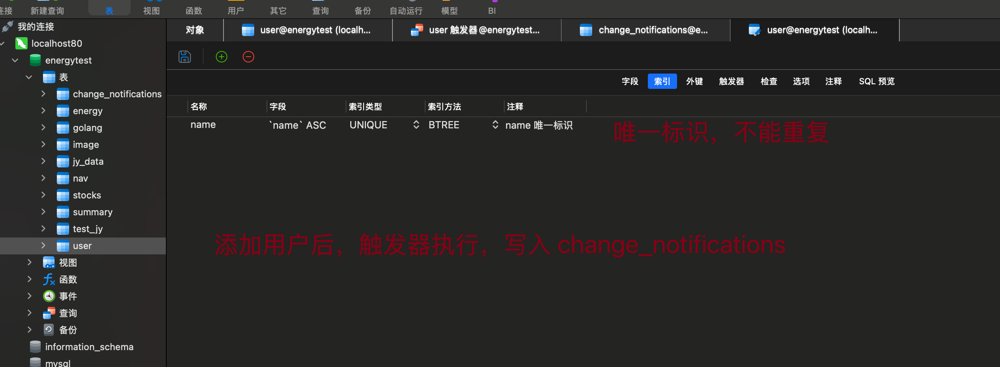

#  MySQL 学习

***创建时间 2021-10-17***


## 专业术语

***创建时间 2021-12-12***

------

表：具有固定的列数和任意的行数

列：一个数据项 `Field` 字段

行：一条记录 `row`

数据库：数据库是一些关联表的集合

主键：主键是唯一的。一个数据表中只能包含一个主键。你可以使用主键来查询数据。

外键：外键用于关联两个表

索引：使用索引可快速访问数据库表中的特定信息。索引是对数据库表中一列或多列的值进行排序的一种结构。类似于书籍的目录。


## 基本概念

### SQL结构化查询语言

DDL：数据定义语言，操作数据对象（库，表，视图，存储过程）

DML：数据操控语言，操作数据库中的记录

DQL：数据查询语言，用来查询数据

DCL：数据控制语言，操作用户权限


## 基本使用

#### 	管理表

```sql
# 查看有哪些数据库
SHOW DATABASES
# 显示有哪些表
SHOW TABLES
# 查看某个表中的千全部数据
SELECT * FROM `user`
```


#### 	***字段(数据)类型***

显示地址： [SQL 数据类型.xlsx](../../../../Downloads/SQL 数据类型.xlsx) 

------

|     类型      |                     描述                     |
| :-----------: | :------------------------------------------: |
|      bix      |           占1位，0或1，false或true           |
|      int      |                 占32位，整数                 |
| decimal(M, N) | 能精确计算的实数，M是总数字位数，N是小数位数 |
|    char(n)    |              固定长度位n的字符               |
|  varchar(n)   |         长度可变，最大长度位n的字符          |
|     text      |                  大量的字符                  |
|     date      |                    仅日期                    |
|   datetime    |                  日期和时间                  |
|     time      |                    仅时间                    |

1. 大致可以分为三类：数值类型 字符串类型 日期和时间类型
2. 常用数据类型：
   1. double：浮点型，
   2. char：固定长度字符串类型
   3. varchar: 可变长度字符串类型，最大支持字节6万。在UTF-8的情况下中文占3个字节
   4. text: 字符串类型
   5. blob: 二进制类型
   6. date: 日期类型，time: 时间类型，datetime: 日期时间类型
   7. 
3. 

#### ***复杂情况***

|    类型    |                             描述                             |
| :--------: | :----------------------------------------------------------: |
|    JSON    |      可以方便地存储复杂的结构化数据，包括数组形式的数据      |
|    TEXT    | 类型能存储较长的文本数据，`TEXT`最大长度为 65,535 字节（大约 64KB） |
| MEDIUMTEXT |                      最大长度约为 16MB                       |
|  LONGTEXT  |                       最大长度约为 4GB                       |
|            |                                                              |
|            |                                                              |
|            |                                                              |


```sql
# 安装完成后进入安装目录中的bin文件夹中查看是否安装成功
cd *****\bin
# 查询数据库
mysql -u root -p
password: 123456789
```


## 基本命令  定义 DDL

1. 查看表结构 <span style="color: red">desc 表名</span>

   ```sql
   desc 表名
   desc TestJy;
   ```

   

2. 创建表：<span style="color: red">create table 表名</span>

   1. 先进入某一个数据库；
   2.  输入建表的命令

   ```sql
   CREATE TABLE 表名(
   	列名1 列的类型 【约束】，
     列名2 列的类型 【约束】，
     ...
     列名n 列的类型 【约束】
   );
   注意：最后一行没有逗号
   CREATE TABLE TestJy (
   	id BIGINT,
   	jy_code VARCHAR(6),
   	jy_name VARCHAR(20),
   	jy_mon VARCHAR(10)
   );
   ```

   

3. 添加一列（修改表）<span style="color: red">add</span>

   ```sql
   // ALTER TABLE 表名 ADD 列名 数据类型；
   ALTER TABLE testjy ADD jy_buy_date DATE;
   ```

    

4.  修改一个表的字段类型 <span style="color: red">modify</span>

   ```sql
   // ALTER TABLE 表名 MODIFY 字段名 数据类型；
   ALTER TABLE testjy MODIFY jy_buy_date datetime;
   ```

   

5.  修改表名 <span style="color: red">to</span>

   ```sql
   RENAME TABLE 旧表名 to 新表名;
   RENAME TABLE testjy to test_jy;
   ```

   

6.  修改表的字符集为**其他字符集** <span style="color: red">character</span>

   ```sql
   ALTER TABLE test_jy CHARACTER SET XXX
   ```

   

7.  修改表的列名 <span style="color: red">change</span>

   ```sql
   ALTER TABLE 表名 CHANGE 原始列名 新列名 数据类型;
   ALTER TABLE test_jy CHANGE  jy_del_date jy_delete_date datetime;
   ```

   

8.  删除一列 <span style="color: red">drop</span>

   ```sql
   ALTER TABLE 表名 DROP 字段名
   ALTER TABLE test_jy DROP jy_delete_date;
   ```

   

9.  删除表 <span style="color: red">drop table 表名</span>

   ```mysql
   DROP TABLE 表名
   ```

   

10.  

```sql
// 添加一个字段 并指定属性
# ALTER TABLE testjy ADD jy_del_date datetime; 
// 删除一列
# ALTER TABLE test_jy DROP jy_delete_date;
// 修改表格的列名
# ALTER TABLE test_jy CHANGE  jy_del_date jy_delete_date datetime;
// 修改 字段 的属性
# ALTER TABLE testjy MODIFY jy_buy_date date;
//  表重命名
# RENAME TABLE testjy to test_jy;

# ALTER TABLE test_jy ADD jy_del_date datetime;

DESC test_jy;
```


## 数据操作 DML

### 添加 insert into 表名

1. 数据添加 <span style="color: red">insert into 表名</span>

   ```mysql
   # 全字段插入 
   INSERT INTO 表名 VALUES (有多少字段就得有几个值);
   
   # 基础语法 
   INSERT INTO table_name (column1, column2, column3,...) VALUES (value1, value2, value3,...);
   
   # 批量添加数据
   INSERT INTO 表名 (字段名1，字段名2，...) VALUES (值1，值2，...),(值1，值2，...), (值1，值2，...);
   
   INSERT INTO test_jy VALUES(2,  '002027', '分众传媒', 10000, '2021-11-11', '2021-11-20' );
   
   # 根据部分字段插入 INSERT INTO 表名 (字段名) VALUES(对应的值)
   INSERT INTO test_jy (id, jy_code, jy_mon) VALUES(3, '600552', 3000 );
   ```
   
   
   
   ```mysql
   # 基础使用命令
   # 添加单条数据
   # 指定字段名称
   INSERT INTO nav (id, `name`) VALUES (1, 'golang');
   # 不指定字段名称，（注意填写全部的数据）
   INSERT INTO nav VALUES(9, '动态添加一条数据');
   
   # 添加多条数据
   INSERT INTO nav ( id, `name` )
   VALUES ( 2, 'nodejs' ), ( 3, 'php' ), ( 4, 'java' ), ( 5, 'rust' );
   ```
   
   

### 删除 delete form 表名

1. 数据删除  <span style="color: red">delete from 表名</span>

   ```mysql
   # 全部删除 DELETE FROM 表名；
   DELETE FROM test_jy
   
   # 根据条件删除 DELETE FROM 表名 where 条件
   DELETE FROM test_jy WHERE id = 4;
   
   # TRUNCATE TABLE 表名（先执行 drop 再创建一个表）
   TRUNCATE TABLE table_name;
   ```


### 更新 update 表名  set

1. 数据 修改更新 <span style="color: red">**set**</span>

   ```mysql
   # 基础语法
   UPDATE 表名 set 字段 = 新值 [字段 = 新值， 字段 = 信值， ...][where 条件筛选]
   
   # 更新单个字段（整个表） UPDATE 表名 SET 字段 = 值
   UPDATE test_jy SET jy_code = '000001';
   
   # 更新多个字段 
   UPDATE test_jy SET jy_code='600869', jy_name='远东', jy_mon='10000', jy_buy_date='2021-12-01' where id = 1;
   
   # 根据条件更新
   UPDATE test_jy SET jy_name="分众" WHERE id = 2;
   ```

   

2. 数据查看 <span style="color: red"> select from 表名</span>

   ```mysql
   # 查看全部字段 SELECT * FROM 表名;
   SELECT * FROM test_jy;
   
   # 查看部分字段，字段名 使用逗号（,）分割
   SELECT id, jy_code, jy_mon FROM test_jy;
   ```

   

3. 修改数据库密码 mysql8 以上

   ```mysql
   ALTER USER 'root' @"localhost" IDENTIFIED BY '新密码'
   ```

    

4. 

```mysql
// 数据全字段新增
INSERT INTO test_jy VALUES(2,  '002027', '分众', 10000, '2021-11-11', '2021-11-20' );
// 根据字段插入数据
INSERT INTO test_jy (id, jy_code, jy_mon) VALUES(3, '600552', 3000 );
INSERT INTO test_jy (id, jy_name) VALUES(4, '用来测试删除');

// 数据更新
UPDATE test_jy SET jy_code = '000001';
// 更新全部（多个）字段
UPDATE test_jy SET id=1, jy_code='600869', jy_name='远东', jy_mon='8800', jy_buy_date='2021-12-01';
// 根据条件更新
UPDATE test_jy SET jy_code="000001" WHERE id = 1;

CREATE TABLE table_name(
	id CHAR,
	name VARCHAR(10)
);
DROP TABLE table_name;


// 删除表 内容
TRUNCATE TABLE table_name;
// 数据删除，根据条件
DELETE FROM test_jy WHERE id = 4;

DESC test_jy;
// 查看全部数据
SELECT * FROM test_jy;
// 根据条件查看数据
SELECT id, jy_code, jy_mon FROM test_jy;
```


## 数据查询  DQL

### 查询所有列<span style="color: red"> select from 表名</span>

```mysql
# 查询所有列，表中的全部数据
SELECT * FROM test_jy;

# 查询部分 指定的列
SELECT id, jy_code FROM test_jy;
# 查询部分，根据指定的条件
SELECT * FROM `user` WHERE id = 5
# 查询当天的全部数据
SELECT * FROM jy_data WHERE DATE(NOEDATE) = CURDATE();

# 设置别名
SELECT 字段1[AS 别名1]，字段2[AS 别名2],... FROM 表名;
```


### 条件查询 <span style="color: red"> where</span>

1. 在查询时给出where子句，在where子句中可以使用一些运算符及关键字
2. 运算符：=   !=   <>(不等于)   <   <=   >   >=
3. 关键字：
   1. between...and：在什么范围内（between 最小值 and 最大值）
   2. in(set)  固定的范围值
   3. is null 没有值   
   4. is not null 具有一个值
   5. and 两个条件语句都为真
   6. or   两个条件语句之一为真（ || ）
   7. not  条件语句不为真

```mysql
# 语法：SELECT 字段列表 FROM 表名 WHERE 条件列表;
# 查询mon在  3000 到 9000 的数据
SELECT * FROM test_jy WHERE  jy_mon >= 3000 and jy_mon <= 9000;
SELECT * FROM test_jy WHERE jy_mon BETWEEN 3000 AND 5000;

# 查询 jy_code 为 000001 002027 600552 
SELECT * FROM test_jy WHERE jy_code in('000001', '002027', '600552');

# 查询 jy_del_date 为 null
SELECT * FROM test_jy WHERE jy_del_date is NULL;
# 查询 jy_del_date 不为 null
SELECT * FROM test_jy WHERE jy_del_date IS NOT NULL;

# 查询时间在12月之后的`并且`名称为远东
SELECT * FROM test_jy WHERE jy_buy_date < "2021-12-12" AND jy_name = "远东";

# 查询000001`或`002027
SELECT * FROM test_jy WHERE jy_code="000001" or jy_code="002027";

```


### 模糊查询 <span style="color: red"> like</span>

1. _ 通配符： 任意一个字母（包含中文）
2. % 通配符：任意 0 ~ n 个字母

```mysql
-- 查询jy_name由两个字母构成 
SELECT * FROM test_jy WHERE jy_name LIKE "__";
-- 查询jy_name由两个字母构成并且第二个字母为 东
SELECT * FROM test_jy WHERE jy_name LIKE "_东"; 
-- 查询jy_code以 00 开头
SELECT * FROM test_jy WHERE jy_code LIKE "00%";
-- 查询jy_code包含 00
SELECT * FROM test_jy WHERE jy_code LIKE "%00%";
-- 查询jy_code包含 00 或 1
SELECT * FROM test_jy WHERE jy_code LIKE "%00%" or "%1%" ;
-- 查询jy_code包含 00 或 1 或者 jy_mon 中含有 00
SELECT * FROM test_jy WHERE jy_code LIKE "%00%" or "%1%" OR jy_mon LIKE "00";
SELECT * FROM test_jy WHERE CONCAT(jy_code, jy_mon) LIKE "%00%" or "%1%" ;

```


### 字段控制查询 <span style="color: red"> distinct ifunll</span>

1. 去除重复记录 distinct 
2. 把查询结果进行运算，必须都要是数据型。ifnull(字段, 值)
3. 对查询结果起别名 as

```mysql
-- 去重
SELECT DISTINCT jy_code FROM test_jy;
--  jy_code 与 jy_mon 结果相加
SELECT *, jy_code + jy_mon FROM test_jy;
-- 如果字段存在null时转为0
SELECT *, IFNULL(jy_code,0) + IFNULL(jy_mon,0) FROM test_jy;
-- 对相加的结果起别名
SELECT *, IFNULL(jy_code,0) + IFNULL(jy_mon,0) AS code_mon_total FROM test_jy;
```


### 排序 <span style="color: red"> order by</span>

1. 升序 ASC
2. 降序 DESC

```mysql
SELECT * FROM 表名 ORDER BY 字段;

-- 这种方法如果不是数字类型会根据开头字母排序
SELECT * FROM test_jy ORDER BY jy_mon;

-- 将不是数字类型转化为 decimal
SELECT * FROM test_jy ORDER BY CONVERT(jy_mon, decimal) ASC;
```


### 聚合函数 <span style="color: red"> 分组查询函数</span>

说明：将一列数据作为一个整体，进行纵向计算

| 函数    | 用法          | 描述                 |
| ------- | ------------- | -------------------- |
| AVG()   | AVG(column)   | 返回列的平均值       |
| COUNT() | COUNT(column) | 统计行数，排除null值 |
| MAX()   | MAX(column)   | 求列中的最大值       |
| MIN()   | MIN(column)   | 求列中的最小值       |
| SUN()   | SUN(column)   | 求列中的和           |

```sql
# 统计表中的的数量
SELECT COUNT(id) FROM jy_data;

```


### 分组查询

where 与 having 区别

+ 执行时机不同：where 是分组之前进行过滤，不满足 where 条件不参与分组。而 having 是分组之后对结果进行过滤。
+ 判断条件不同：where 不能对`聚合函数`进行判断，而 having 可以。
+ 执行顺序：where > 聚合函数 > having
+ 分组之后，查询的字段一般为聚合函数和分组字段，查询其他字段无任何意义。

```sql
SELECT 字段列表 FROM 表名 [WHERE 条件] Group BY 分组字段名 [HAVING 分组后过滤条件];
# 查询 2025-01-03 这天的数据分组统计总数
SELECT Dryk, COUNT(*) FROM jy_data WHERE DATE(NOEDATE) IN("2025-01-03") GROUP BY Dryk; 

# 查询 2025-01-03 这天的数据，统计大于零的数据与小于零的数据
SELECT CASE
	WHEN Dryk > 0 THEN "Positive"
	WHEN Dryk < 0 THEN "Negative"
	ELSE "Zero" END AS Dryk_Group,
COUNT(*) AS RecordCount
FROM jy_data WHERE DATE(NOEDATE) IN("2025-01-03") GROUP BY 
CASE 
	WHEN Dryk > 0 THEN 'Positive'
	WHEN Dryk < 0 THEN 'Negative'
	ELSE 'Zero'
END;
```


### 多表关联查询

MYSQL别名，关联查询

#### 笛卡尔积连接

```mysql

```


#### 内连接（推荐 INNER JOIN）

```mysql
INNER JOIN 查询

```


#### 左外连接

**核心逻辑：**以“左表”为基准，保留左表的所有记录，同时匹配右表中满足关联条件的数据；若右表无匹配数据，则右表字段返回NULL

+ 左表主导：左表的所有记录都会被保留，不会因右表无匹配而过滤
+ 右表匹配：只显示右表中与左表满足「关联条件」的记录，不满足则补 NULL
+ 关联条件：通过 **ON** 子句指定两表匹配规则（如主键 - 外键关联）

```mysql
SELECT 字段列表
FROM 左表名
【LEFT JOIN / LEFT OUTER JOIN】右表名
ON 左表.关联字段 = 右表.关联字段 -- 两表的匹配条件
【WHERE 过滤条件】； -- 可选：对关联结果进一步过滤


SELECT
	sys_menu.* 
FROM
	sys_menu
	LEFT JOIN sys_menu_role ON sys_menu.id = sys_menu_role.menu_id 
WHERE
	sys_menu_role.role_id = 1;
```


#### 右外连接


### 内置函数

参考：https://www.cnblogs.com/CrispyCandy/articles/17709514.html


# 索引

***创建时间 2025-08-15***



# 触发器

***创建时间 2025-08-14***

```mysql
# 触发时机：AFTER INSERT
# 触发对象：user 表
# 触发行为：FOR EACH ROW（对每一行插入操作触发）

-- 先删除已存在的触发器
DROP TRIGGER IF EXISTS after_user_insert;

# DELIMITER 其实就是告诉mysql解释器，该段命令是否已经结束了，mysql是否可以执行了。 默认情况下，delimiter是分号;。修改为$$ 这样就可以触发器内部使用分号
DELIMITER $$ 
CREATE TRIGGER after_user(name)_insert # 创建触发器，名为 after_user(name)_insert
AFTER INSERT on `user` # 触发器在 user 表发生 insert 操作之后触发
FOR EACH ROW # 触发器对每一行插入操作都执行一次
BEGIN # 开始，注意 change_notifications 表是否提取创建
	INSERT INTO change_notifications (table_name, operation, record_id, new_data, created_at)
	VALUES('user', 'INSERT', NEW.id, JSON_OBJECT(
				'id', NEW.id,
        'name', NEW.name,
        'password', NEW.password,
        'age', NEW.age,
        'email', NEW.email,
        'created_at', NEW.created_at,
        'updated_at', NEW.updated_at,
        'description', NEW.description
	), NOW());
	END$$
DELIMITER ;
```


# 高级语法


# 云服务 mysql 配置

```bash
# 重启 MySQL 服务： 保存并退出编辑器后，重启 MySQL 服务以应用更改。
sudo systemctl restart mysqld

# 这里的 username 和 password 需要替换为实际的用户名和密码。% 表示允许任何 IP 地址访问。
GRANT ALL PRIVILEGES ON *.* TO 'username'@'%' IDENTIFIED BY 'password';
FLUSH PRIVILEGES;
```


# GORM 使用

***创建时间：2026-01-15***

------


